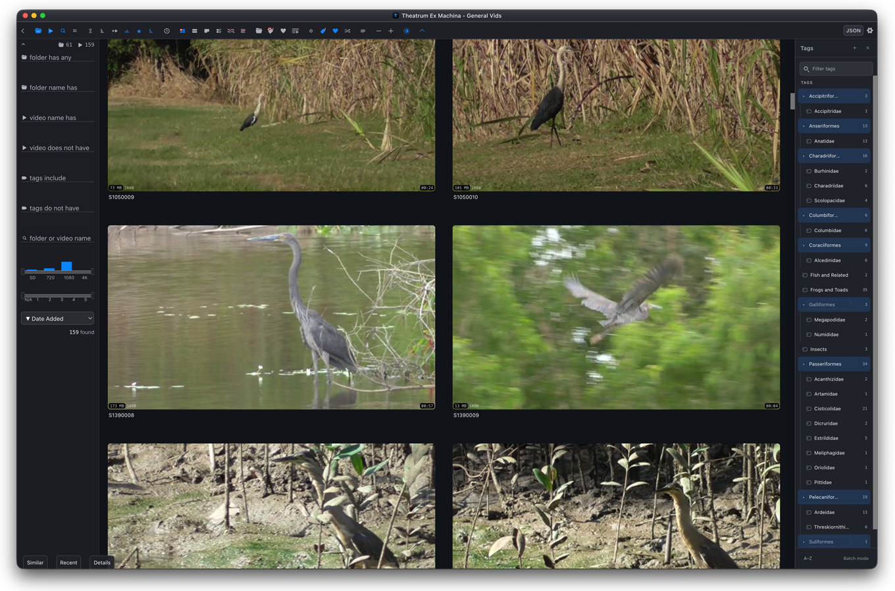

# Theatrum Ex Machina

**Theatrum Ex Machina** is a personal fork of [Video Hub App](http://www.videohubapp.com/), maintained at [sebiimaks/Theatrum-Ex-Machina](https://github.com/sebiimaks/Theatrum-Ex-Machina). Its name and logo are fork-specific branding and are not associated with or endorsed by the original developer.

**Fork changes are made utilising LLMs. The fork is not supported or endorsed by the original developer. Use this software at your own risk.**

- Current fork version: `v1.1.2`
- Change summary updated: 03/09/2026

# Fork Changelog

This changelog covers material fork-specific changes made after the upstream baseline at [`dcb3229`](https://github.com/whyboris/Video-Hub-App/commit/dcb3229). Documentation-only, CI-only, release-bookkeeping, and temporary workflow commits are intentionally omitted. Select a release, then a commit, to expand its details.

`v1.0.0` begins the independent Theatrum Ex Machina version line. Earlier entries preserve the fork's pre-1.0 development history.

<strong>Unreleased</strong>

<strong>Fix restored legacy catalogue startup and shutdown</strong>

Restored startup when the saved current catalogue is a legacy <code>.vha2</code> file: the read-only-or-duplicate decision now appears above the startup cover, and cancelling the initial decision returns to the opening wizard. Closing from that decision or before any catalogue has opened now saves application settings without attempting a catalogue write, while a missing or stale renderer can no longer trap the app in its shutdown handshake. Active editable catalogues retain the existing save-before-close protections.

<strong>Reduce dependency and packaged-runtime debt</strong>

Replaced the obsolete third-party Trash wrapper with Electron's native, literal-path Trash operation, removing its vulnerable UUID and globbing dependency chain from the shipped application. Removed the broad forced <code>glob</code> and <code>minimatch</code> downgrades, moved linting from the unsupported ESLint 8 line to ESLint 9 without changing the existing lint baseline, and regenerated the lockfile from an isolated dependency resolution. Runtime staging remains limited to the exact production closure, while third-party notice generation now follows the exact packaged Node, optional packaging, and compiled-renderer dependency sets.

Applied the compatible maintenance releases across Angular, Angular Material, Angular ESLint, TypeScript ESLint, Electron, and Electron Builder, and aligned the declared Node.js support range with the complete build toolchain. The live npm audit now falls from 102 affected package nodes to eight moderate findings, all confined to the development-server and build-tool chain; the production-and-non-optional audit reports zero findings. No high or critical advisories remain, and no forced audit rewrite or framework-major migration was used.

The staged Node runtime contains none of the removed <code>trash</code>, <code>uuid</code>, <code>glob</code>, <code>globby</code>, <code>minimatch</code>, or <code>brace-expansion</code> packages.

<strong><a href="https://github.com/sebiimaks/Theatrum-Ex-Machina/releases/tag/v1.1.2">v1.1.2</a> — 1 September 2026</strong>

<a href="https://github.com/sebiimaks/Theatrum-Ex-Machina/commit/b8f36e43af7649308ed8293e2103acd9f9441952"><code>b8f36e43</code></a> — <strong>Refactor thumbnail regeneration state and IPC</strong>

Moved folder thumbnail-regeneration bookkeeping and all individual and folder regeneration messaging out of the main Home component into typed, independently testable sessions, coordinators, and services. Incoming events are validated at runtime, listeners are disposed and fenced against stale callbacks, and progress is correlated to the exact request, catalogue, source, and expected video hashes. Same-path catalogue reloads retain a safe cancellation tombstone, malformed progress can cancel only the authenticated active batch, and stale or duplicate terminal events cannot mutate a newer catalogue session.

<a href="https://github.com/sebiimaks/Theatrum-Ex-Machina/commit/b67cf67efffbfa1726dc2be160acf7325f6a74c7"><code>b67cf67e</code></a> — <strong>Refactor catalogue persistence and gallery state</strong>

Split catalogue opening, save and close messaging, catalogue-document projection, and gallery-layout policy out of the main Home component into typed coordinators and focused services. Catalogue requests remain serialised, late callbacks from disconnected listeners are ignored, save and close state transitions retain their established behaviour, and gallery measurement timing stays in the renderer while deterministic layout calculations can be tested independently. Focused lifecycle and parity coverage protects the user-visible workflows during further decomposition of central application state.

<a href="https://github.com/sebiimaks/Theatrum-Ex-Machina/commit/ceaa3c21f5b0420635cdcedd16245eedee2b5a27"><code>ceaa3c21</code></a> — <strong>Harden Electron and media authority boundaries</strong>

Sandboxed and context-isolated the renderer behind a narrow allowlisted preload bridge, replaced unrestricted local-file access with constrained application and generated-media protocols, and moved catalogue, source-folder, media-location, and write authority into the main process. Catalogue transitions and generated-preview mutations are serialised; extraction inputs and output roots are validated against canonical filesystem identities; stale, redirected, or unauthorised renderer requests fail closed. Regression and packaged-application checks now cover the hardened Electron boundary, persistence authority, path handling, and preview publication lifecycle.

<strong><a href="https://github.com/sebiimaks/Theatrum-Ex-Machina/releases/tag/v1.1.1">v1.1.1</a> — 22 August 2026</strong>

<a href="https://github.com/sebiimaks/Theatrum-Ex-Machina/commit/4f65fc2"><code>4f65fc2</code></a> — <strong>Fix compact gallery layout on startup</strong>

Compact View now restores its saved gallery geometry correctly at startup, including when the sidebar or Tags panel is open. The gallery renders restored layout classes before measuring, observes later gallery-width changes, and refreshes virtual-scroller measurements after panel transitions, so thumbnails fill the available space without toggling the view off and on.

<a href="https://github.com/sebiimaks/Theatrum-Ex-Machina/commit/7638bd7"><code>7638bd7</code></a> — <strong>Add compact clean-name thumbnail controls</strong>

Compact View can now optionally show each video’s clean catalogue name inside the preview, with its metadata row immediately above. The option is available in View Settings and from a toolbar glyph beside Compact View; existing settings profiles reveal it automatically. The playlist control now sits at the top beside Favorites, leaving the thumbnail information unobscured.

<strong><a href="https://github.com/sebiimaks/Theatrum-Ex-Machina/releases/tag/v1.1.0">v1.1.0</a> — 21 August 2026</strong>

<a href="https://github.com/sebiimaks/Theatrum-Ex-Machina/commit/a04c4d2"><code>a04c4d2</code></a> — <strong>Make catalogue save failures recoverable</strong>

Catalogue Editor now validates media file and folder edits before mutating saved locations, shows inline guidance for invalid paths, and preserves authoritative alternate-location data. Save failures identify the affected catalogue entry. If a catalogue still cannot be saved while closing, the native safety dialog now offers either to keep working or explicitly quit without saving the current catalogue changes, while leaving the existing catalogue file untouched. Regression coverage confirms that ordinary punctuation in custom-thumbnail file names, including ampersands, is accepted.

<a href="https://github.com/sebiimaks/Theatrum-Ex-Machina/commit/e4e09c3"><code>e4e09c3</code></a> — <strong>Restore safe catalogue drag and drop</strong>

Restored opening <code>.scaena</code> and <code>.vha2</code> catalogues dropped onto the app. Dropped files now resolve through Electron’s supported path API and enter the same validated, serialised open workflow as other catalogue requests, preserving the legacy read-only or duplicate choice and keeping custom-thumbnail drops on gallery items isolated from catalogue opening.

<a href="https://github.com/sebiimaks/Theatrum-Ex-Machina/commit/91baf5d"><code>91baf5d</code></a> — <strong>Remove the legacy demo mode</strong>

Removed the dormant demo build flag, the 50-video catalogue and scan limits, the demo labels and translations, and the obsolete standalone demo assets. Catalogues now always load and accept their complete set of videos. Regression, release-preflight, and packaged-application checks prevent the retired limits or stale compiled demo code from returning.

<a href="https://github.com/sebiimaks/Theatrum-Ex-Machina/commit/100cba7"><code>100cba7</code></a> — <strong>Add safe Video Hub App catalogue interoperability</strong>

Opening a legacy <code>.vha2</code> catalogue now presents a structured choice to browse and play it read only, or create a unique adjacent <code>.scaena</code> duplicate and reopen that copy with full editing, scanning, and saving. Read-only sessions display a persistent badge and block catalogue, source-file, scan, watcher, preview, rename, and deletion changes while leaving the original catalogue and backup untouched; if the primary legacy file is invalid, a validated backup can be opened in memory or used to create the duplicate without rewriting the source files.

Current Hub can now export an editable <code>.scaena</code> catalogue as a Video Hub App-compatible <code>.vha2</code> copy after clearly disclosing conversion limits. Export preserves supported video metadata and promotes an available media location, while omitting fork-only Date Added, tag hierarchy, alternate-location, ignored-directory, availability/import-error, and pending-deletion state. Finder, startup, and file-picker open requests are queued and handled in order so multiple requests cannot overlap.

<a href="https://github.com/sebiimaks/Theatrum-Ex-Machina/commit/f19ae57"><code>f19ae57</code></a> — <strong>Harden packaged dependency attribution and licensing</strong>

Added a deterministic, version-specific notice inventory for every dependency present in the packaged application or compiled renderer, with audited historical notices for packages whose published archives omit complete attribution. Packaged builds now expose renderer, Electron, Chromium, and runtime notices in a readable legal directory, while release verification fails if packaged dependencies and tracked notices differ. FFmpeg and x264 distribution guidance now reflects the published binary workflow and its matching corresponding-source requirement.

<a href="https://github.com/sebiimaks/Theatrum-Ex-Machina/commit/0c39dbe"><code>0c39dbe</code></a> — <strong>Remove the unused local server</strong>

Removed the unused local web server and remote-control feature, including its Current Hub controls, IPC and saved settings, bundled resources, translations, and server-only runtime dependencies. Packaging checks now prevent retired server files or dependencies from re-entering builds, reducing unused code and maintenance surface without changing local catalogue workflows.

<strong><a href="https://github.com/sebiimaks/Theatrum-Ex-Machina/releases/tag/v1.0.0">v1.0.0</a> — 16 August 2026</strong>

<a href="https://github.com/sebiimaks/Theatrum-Ex-Machina/commit/cf87ade"><code>cf87ade</code></a> — <strong>Align the opening wizard with Settings</strong>

Restyled the opening wizard with the same numbered review-ledger structure, typography, borders, spacing, and controls as Settings. Opening an existing catalogue and creating a new one now have clearer visual grouping while retaining the existing workflow, saved-theme behaviour, and responsive layout.

<a href="https://github.com/sebiimaks/Theatrum-Ex-Machina/commit/ec5f0da"><code>ec5f0da</code></a> — <strong>Selectively incorporate applicable upstream fixes</strong>

Removed the obsolete override of Electron's built-in <code>file:</code> protocol while retaining normal catalogue, media, and preview loading. The Details tray thumbnail now exposes the existing video context menu, and synthetic Folder View entries carry Last Played and Times Played values from their contained videos so those sorting modes also work at folder level. Folder rows now use a distinct namespaced identity to avoid colliding with the first video they contain, with regression coverage for each adapted change.

<a href="https://github.com/sebiimaks/Theatrum-Ex-Machina/commit/c7be038"><code>c7be038</code></a> — <strong>Restore and streamline Main Settings zoom controls</strong>

Restored the missing decrease and increase controls in Main Settings as compact, theme-aware circular buttons with visible symbols, hover and keyboard-focus feedback, and accessible labels. Removed the repeated zoom and language labels from their content rows, then left-aligned the zoom controls and a proportionately sized language selector beneath their existing section headings.

<a href="https://github.com/sebiimaks/Theatrum-Ex-Machina/commit/765bd3f"><code>765bd3f</code></a> — <strong>Improve Current Hub folder management and extraction safety</strong>

Restyled every settings tab as a structured review ledger and reorganised Current Hub around clearer catalogue, video-location, server, and summary sections. Configured roots now expose expandable subdirectory trees with independent rescanning and thumbnail regeneration, optional empty-folder hiding, persistent per-subdirectory ignore controls, and separate choices for scanning and preview generation when adding or rescanning folders. Ignoring a subtree excludes it from future scans and removes only its catalogue associations; entries reachable through another configured location retain their metadata, while metadata-bearing removals receive a structured confirmation.

Overlapping parent and child source folders now resolve to one logical catalogue entry with multiple durable locations, preserving tags, notes, ratings, play history, Date Added, and availability when either source is removed or temporarily offline. Rescan snapshots, watcher restoration, playback paths, folder statistics, and thumbnail planning understand those alternate locations. Extraction was also hardened for broad and network-hosted folders with bounded directory traversal, deduplicated work, controlled decoder concurrency, cancellable media processes, sequentially assembled filmstrips, scan safety limits, and batched interface refreshes. These changes prevent the previous memory and allocation spikes while retaining practical throughput on capped network storage.

<strong><a href="https://github.com/sebiimaks/Theatrum-Ex-Machina/releases/tag/v3.3.0-tem.3">v3.3.0-tem.3</a> — 7 August 2026</strong>

<a href="https://github.com/sebiimaks/Theatrum-Ex-Machina/commit/371e976"><code>371e976</code></a> — <strong>Add persistent hierarchical tagging</strong>

Manual tags can now be organised into persistent nested hierarchies in the Tags tray. Tags and branches can be created independently of videos, moved or separated with drag and drop, coloured individually, filtered as exact tags or complete branches, and removed catalogue-wide with affected-video safeguards. Unassigned tag definitions survive saving and reopening, while Catalogue Editor metadata import and search preserve canonical hierarchy paths. Batch assignment supports nested tags, and Video Details presents compact individual tag levels whose removal is restricted to the selected hierarchy branch and its descendants, including when unrelated branches use the same visible name.

<a href="https://github.com/sebiimaks/Theatrum-Ex-Machina/commit/fa9e7a4"><code>fa9e7a4</code></a> — <strong>Move hierarchical tags into a right-side source panel</strong>

Replaced the bottom Tags tray with a compact right-side source panel that keeps nested tags visible alongside the gallery. The panel provides filtering, independent tag creation, hierarchy expansion, frequency display, sorting, batch assignment, drag-and-drop organisation, and catalogue-wide removal controls. Gallery and breadcrumb sizing now adapt to the panel, while a floating Tags control opens it without displacing the other tray tabs.

<a href="https://github.com/sebiimaks/Theatrum-Ex-Machina/commit/fa9e7a4"><code>fa9e7a4</code></a> — <strong>Clarify application confirmation dialogs</strong>

Reworked renderer confirmation dialogs into a consistent progressive-disclosure layout with concise summaries, before-and-after transitions, supporting safety guidance, expandable impact details, and action-specific warning or destructive styling. Metadata changes, thumbnail regeneration, file deletion, and hierarchy operations now present their scope more clearly before execution.

<strong><a href="https://github.com/sebiimaks/Theatrum-Ex-Machina/releases/tag/v3.3.0-tem.2">v3.3.0-tem.2</a> — 4 August 2026</strong>

<a href="https://github.com/sebiimaks/Theatrum-Ex-Machina/commit/4053cbc"><code>4053cbc</code></a> — <strong>Add safe Catalogue Editor metadata transfer</strong>

Added human-readable metadata export and category-selectable import matched solely by globally unique file hashes. Imports are limited to the Catalogue Editor results displayed when import begins, enter a read-only preview showing only affected entries, highlight every proposed field change, require confirmation, and revalidate before mutation. Save notices now follow the actual catalogue save result. The search selector also covers every editable field, visible file detail, and entry state using human-readable values.

<a href="https://github.com/sebiimaks/Theatrum-Ex-Machina/commit/d3a5f73"><code>d3a5f73</code></a> — <strong>Put Catalogue Editor match controls first</strong>

Reordered each Catalogue Editor search line so its Contains or Does Not Contain condition appears before the search text and field selector. The visual order and keyboard tab order now follow the same condition–query–field sequence, with responsive layouts preserving that relationship on narrower windows. Regression coverage guards the intended control order.

<a href="https://github.com/sebiimaks/Theatrum-Ex-Machina/commit/8755aea"><code>8755aea</code></a> — <strong>Stabilise scrolling across gallery detail views</strong>

Full View now uses deterministic row geometry and a small rendering buffer, while gallery measurements are refreshed in a coordinated order after view, size, zoom, ribbon, sidebar, and tray changes. Details View and Details View 2 no longer focus every newly recycled Add tag field, which previously made Chromium race through the catalogue as virtual rows were created. Measurement-distorting height transitions and the decorative virtual-scroller spacer were also removed, with regression coverage added for layout calculations and focus behaviour.

<a href="https://github.com/sebiimaks/Theatrum-Ex-Machina/commit/3d5b67c"><code>3d5b67c</code></a> — <strong>Make rescans recoverable and restore settings feedback</strong>

Repeated folder scans now use isolated per-source snapshots, ignore stale or failed results, and retain temporarily unavailable videos so tags, notes, ratings, play history, Date Added, and other user metadata survive network or external-drive interruptions. Recovered or renamed files replace their previous entry instead of accumulating obsolete records. Unavailable entries stay out of the normal gallery and thumbnail work and can be filtered explicitly in the Catalogue Editor. Settings option icons also retain visible selected states and balanced spacing, while inactive tabs use opaque theme-aware hover feedback.

<a href="https://github.com/sebiimaks/Theatrum-Ex-Machina/commit/a18e18d"><code>a18e18d</code></a> — <strong>Replace branding with theme-aware Blue T icons</strong>

Replaced the previous green roundel throughout the interface, startup screen, file association, Dock integration, and generated macOS, Windows, and Linux icon sets with the supplied Blue T artwork. Dark mode and the dark static application icon are the defaults, while the running macOS Dock icon follows the saved in-app theme. Packaged assets are checked against the reviewed light and dark masters.

<a href="https://github.com/sebiimaks/Theatrum-Ex-Machina/commit/d341e1c"><code>d341e1c</code></a> — <strong>Modernise the interface and Catalogue Editor search</strong>

Applied the Frosted Graphite design across the title bar, toolbar, sidebar, gallery, trays, settings, wizard, Catalogue Editor, video details, dialogs, and context menus. Typography, spacing, semantic colours, controls, focus states, and light and dark mode treatment are now more consistent while preserving existing workflows. Catalogue Editor search rows also gained case-insensitive Contains and Does Not Contain operators that combine cumulatively and handle missing fields correctly.

<strong><a href="https://github.com/sebiimaks/Theatrum-Ex-Machina/releases/tag/v3.3.0-tem.1">v3.3.0-tem.1</a> — 1 August 2026</strong>

<a href="https://github.com/sebiimaks/Theatrum-Ex-Machina/commit/2f091e6"><code>2f091e6</code></a> — <strong>Rebrand the application as Theatrum Ex Machina</strong>

Renamed the application and replaced inherited package names, platform identifiers, visible links, settings identity, icons, and logos while retaining upstream attribution and licensing. New hubs use the <code>.scaena</code> extension with Finder and wizard support, while legacy <code>.vha2</code> and JSON catalogues remain compatible. The opening wizard follows the saved theme, packaged applications include their complete runtime dependencies, and thumbnail regeneration gained visible progress, cancellation, and shutdown safeguards.

<a href="https://github.com/sebiimaks/Theatrum-Ex-Machina/commit/f472075"><code>f472075</code></a> — <strong>Add persistent Date Added metadata and editing</strong>

Newly discovered videos now receive an absolute Date Added timestamp that is retained through retry, rescan, rename, and move recovery. Legacy entries remain unknown rather than receiving invented dates. The main interface can sort by Date Added, folder rows aggregate the latest known descendant date, and the Catalogue Editor supports validated per-entry and confirmed bulk editing.

<a href="https://github.com/sebiimaks/Theatrum-Ex-Machina/commit/b5a62bf"><code>b5a62bf</code></a> — <strong>Add safe folder thumbnail regeneration and catalogue editing</strong>

Current Hub folders gained confirmed, cancellable thumbnail regeneration with sequential processing, validated staging, rollback, and crash recovery. Unsafe thumbnail settings are normalised, filmstrip scrubbing is stabilised, and conflicting save, close, custom-thumbnail, and editor actions are blocked during regeneration. The Catalogue Editor also gained cumulative search rows, title-case fields, simplified numeric controls, and confirmed bulk replacement for safe metadata fields.

<a href="https://github.com/sebiimaks/Theatrum-Ex-Machina/commit/2caed2a"><code>2caed2a</code></a> — <strong>Show ribbon descriptions beside toolbar icons</strong>

Replaced native ribbon tooltips with a translated inline description that follows pointer hover and keyboard focus. The reserved label area does not shift surrounding controls, and accessible names and visible keyboard-focus indicators remain available.

<a href="https://github.com/sebiimaks/Theatrum-Ex-Machina/commit/44958e5"><code>44958e5</code></a> — <strong>Correct thumbnail regeneration counts</strong>

Regenerated previews now use the current hub extraction settings instead of stale per-video metadata. Completion belongs to the exact queued job, successful counts are synchronised across matching catalogue entries, invalid default screenshots are cleared, and failed or cancelled work leaves catalogue metadata unchanged.

<strong><a href="https://github.com/sebiimaks/Theatrum-Ex-Machina/releases/tag/v3.3.0-sin.8">v3.3.0-sin.8</a> — 24 July 2026</strong>

<a href="https://github.com/sebiimaks/Theatrum-Ex-Machina/commit/0e48891"><code>0e48891</code></a> — <strong>Improve Catalogue Editor entry contrast</strong>

Added alternating row backgrounds, stronger borders, and a clearer action divider so dense Catalogue Editor results are easier to distinguish. Hovered, focused, deleted, light-mode, and dark-mode rows receive distinct visual states, reducing the chance of editing the wrong entry.

<a href="https://github.com/sebiimaks/Theatrum-Ex-Machina/commit/55af515"><code>55af515</code></a> — <strong>Add thumbnail regeneration and hash copying</strong>

Added a context-menu command that recreates the selected video's thumbnail, filmstrip, and enabled preview clip through the existing extraction queue and reports completion or failure. The Catalogue Editor also gained an accessible control for copying a file hash.

<a href="https://github.com/sebiimaks/Theatrum-Ex-Machina/commit/6008b94"><code>6008b94</code></a> — <strong>Refine the Current Hub folder list</strong>

Reduced excess spacing between source folders and styled the final folder name separately, making hubs with several locations more compact while keeping the actual destination easier to identify in dark mode.

<a href="https://github.com/sebiimaks/Theatrum-Ex-Machina/commit/4b0cb25"><code>4b0cb25</code></a> — <strong>Handle media import failures gracefully</strong>

Imports now tolerate damaged, incomplete, slow, or temporarily unavailable media, particularly on mounted and network storage. Probing receives longer timeouts and one settling retry; persistent failures create a thumbnail-free entry tagged <code>import_error</code> and continue importing the remaining files instead of stopping the entire operation. Failure placeholders remain usable across the supported views.

<strong><a href="https://github.com/sebiimaks/Theatrum-Ex-Machina/releases/tag/v3.3.0-sin.7">v3.3.0-sin.7</a> — 22 July 2026</strong>

<a href="https://github.com/sebiimaks/Theatrum-Ex-Machina/commit/822e274"><code>822e274</code></a> — <strong>Harden local operations and media-tool packaging</strong>

Privileged requests are accepted only from the active application window, while paths, links, renames, deletions, and custom-player launches are validated without assembling shell commands. Shutdown waits for catalogue and settings saves. The application uses locally built FFmpeg and FFprobe binaries with matching source, licence notices, architecture and linkage checks, and extraction verification included with the package.

<strong><a href="https://github.com/sebiimaks/Theatrum-Ex-Machina/releases/tag/v3.3.0-sin.6">v3.3.0-sin.6</a> — 21 July 2026</strong>

<a href="https://github.com/sebiimaks/Theatrum-Ex-Machina/commit/dfbf7d0"><code>dfbf7d0</code></a> — <strong>Harden catalogue saves and recovery</strong>

Catalogue and settings writes are validated, atomic, and serialised. New data is written to a temporary file, forced to disk, read back, and then moved into place while the previous valid catalogue remains available as a backup. Opening malformed, empty, unreadable, missing, or disconnected catalogues now produces controlled recovery options instead of crashing, and save failures prevent unsafe hub switching, editor closure, or shutdown.

<strong><a href="https://github.com/sebiimaks/Theatrum-Ex-Machina/releases/tag/v3.3.0-sin.5">v3.3.0-sin.5</a> — 20 July 2026</strong>

<a href="https://github.com/sebiimaks/Theatrum-Ex-Machina/commit/0a5e92c"><code>0a5e92c</code></a> — <strong>Add Catalogue Editor tag workflows</strong>

Added normalised comma-separated tag editing, case-insensitive duplicate prevention, autocomplete, support for new custom tags, and batch tagging of the currently displayed results. Closing the editor refreshes the main gallery, Details tray, and scrolling results immediately.

<a href="https://github.com/sebiimaks/Theatrum-Ex-Machina/commit/e4fa163"><code>e4fa163</code></a> — <strong>Improve global tag removal controls</strong>

Manual tags in the Tags tray can now be removed catalogue-wide after a confirmation dialog identifies the tag and affected-video count. Confirming removes the tag from every video, clears its count and colour metadata, marks the catalogue for saving, and refreshes the open details view.

<a href="https://github.com/sebiimaks/Theatrum-Ex-Machina/commit/1417549"><code>1417549</code></a> — <strong>Improve dark-mode details and sidebar contrast</strong>

Moved Video Details notes into a dedicated right-side area so they no longer overlap the path and restyled local zoom controls for consistency. Search-sidebar filter chips now choose black or white foreground text from their background colour, keeping video-name, tag, folder-name, and fuzzy-search values readable in dark mode.

<strong><a href="https://github.com/sebiimaks/Theatrum-Ex-Machina/releases/tag/v3.3.0-sin.4">v3.3.0-sin.4</a> — 19 July 2026</strong>

<a href="https://github.com/sebiimaks/Theatrum-Ex-Machina/commit/217b6d9"><code>217b6d9</code></a> — <strong>Apply a fork-specific application identity</strong>

Renamed the application, package metadata, visible interface, file association, repository links, and platform identifiers to distinguish the fork from upstream. Added native Debian package metadata, included the upstream MIT licence in installed applications, and displayed clear fork support and attribution information.

<a href="https://github.com/sebiimaks/Theatrum-Ex-Machina/commit/96e52a8"><code>96e52a8</code></a> — <strong>Use the Linux icon set for Debian packaging</strong>

Changed Linux packaging to use the project's PNG icon set rather than the macOS <code>.icns</code> file, supplying Debian with the expected formats and sizes for a correctly presented installed application.

<strong><a href="https://github.com/sebiimaks/Theatrum-Ex-Machina/releases/tag/v3.3.0-sin.3">v3.3.0-sin.3</a> — 19 July 2026</strong>

<a href="https://github.com/sebiimaks/Theatrum-Ex-Machina/commit/22eba40"><code>22eba40</code></a> — <strong>Standardise fork settings and interface wording</strong>

Removed the incompatible upstream update checker and replaced it with clear fork and supported-upstream links. Settings wording, title case, Current Hub grouping, zoom controls, labels, and several copy errors were corrected for a more consistent interface.

<a href="https://github.com/sebiimaks/Theatrum-Ex-Machina/commit/742ea72"><code>742ea72</code></a> — <strong>Improve high-resolution and dark-mode presentation</strong>

Raised the top toolbar to 40 pixels and enlarged its controls and icons, with related offsets adjusted to retain alignment. Dark-mode backgrounds, borders, text, forms, tabs, the Tags tray, sidebar, statistics, and active states gained stronger contrast for improved readability and targeting on high-resolution displays.

<strong><a href="https://github.com/sebiimaks/Theatrum-Ex-Machina/releases/tag/v3.3.0-sin.2">v3.3.0-sin.2</a> — 18 July 2026</strong>

<a href="https://github.com/sebiimaks/Theatrum-Ex-Machina/commit/6deb525"><code>6deb525</code></a> — <strong>Exclude development files from application packages</strong>

Replaced the broad Electron package pattern with an explicit runtime allowlist containing compiled application output, main-process JavaScript, shared interfaces, and translations. Development source, caches, and unrelated project files are no longer shipped, reducing package size and making installed contents more predictable.

<a href="https://github.com/sebiimaks/Theatrum-Ex-Machina/commit/324fb48"><code>324fb48</code></a> — <strong>Confirm file deletion from the context menu</strong>

Added a confirmation dialog before moving a selected video to the trash or deleting it permanently. The prompt names the file, and permanent deletion receives a stronger irreversible-action warning before the main process receives the request.

<strong><a href="https://github.com/sebiimaks/Theatrum-Ex-Machina/releases/tag/v3.3.0-sin.1">v3.3.0-sin.1</a> — 18 July 2026</strong>

<a href="https://github.com/sebiimaks/Theatrum-Ex-Machina/commit/8c50f99"><code>8c50f99</code></a> — <strong>Extend extraction timeouts and reset play counts</strong>

Increased thumbnail and filmstrip extraction time allowances to reduce failures with high-resolution, slow, or network-hosted media. Added a Reset Times Played action that clears every video's play count, resets the related filter, marks changed catalogues for saving, and treats missing legacy values as zero.

<a href="https://github.com/sebiimaks/Theatrum-Ex-Machina/commit/68f2b47"><code>68f2b47</code></a> — <strong>Add the Catalogue Editor</strong>

Added an in-app editor for searching and correcting catalogue metadata including names, paths, tags, ratings, year, play count, default screenshot, and notes. Entries can be marked deleted or restored, active and deleted counts remain visible, and edits can be saved to the open catalogue without restarting the application.

## Distribution and Local Builds

Each GitHub tag provides source archives generated by GitHub. When a release also includes a prebuilt application, the same release must include the exact matching media-source archive, checksum manifest, and the licence and build materials required by the packaged FFmpeg and x264 executables. Packaged applications include the project MIT licence, version-pinned Node/runtime notices, production renderer notices, Electron's MIT licence, Chromium's third-party credits, and the media-program notices. Locally built applications do not include automatic update checking.

Before building, install the project's development prerequisites and review `LICENSE`, the generated third-party notices, and the media-tool licensing documentation.

### macOS ARM64

On an Apple Silicon Mac, run `npm run electron:mac:release`. The command builds an unsigned and unnotarized ARM64 DMG, creates the matching media-source archive, and verifies the packaged application and licensing payload. Outputs are written to the ignored `release/` directory. The reproducible unpacked staging application may be deleted after verification.

### ~~Debian 13 AMD64~~

~~Debian packages must be built natively on Debian 13 AMD64; cross-building them on macOS is not supported. Run `npm run electron` after installing the required development tools and preparing the platform-specific media binaries. The resulting Debian package and matching media-source archive should be distributed together with all required licence materials if they are shared outside the local system.~~

## Licensing and Attribution

This fork exists because the original application is useful and well designed. For the supported Video Hub App, documentation, and official releases, visit [videohubapp.com](http://www.videohubapp.com/) or the [whyboris/Video-Hub-App repository](https://github.com/whyboris/Video-Hub-App). Please support the original developer, [whyboris](https://github.com/whyboris).

Theatrum Ex Machina is a personal fork of Video Hub App, copyright © 2022 Boris Yakubchik. The application and fork modifications are distributed under the [MIT License](./LICENSE).

Third-party software retains its own copyright and licence terms. Required notices for software distributed with the application are provided in [Third-party notices](./legal/THIRD_PARTY_NOTICES.txt) and in each packaged build.

Packaged `ffmpeg` and `ffprobe` executables include FFmpeg and x264 components under GPL-2.0-or-later. See the [FFmpeg and x264 notice](./legal/MEDIA-TOOLS.md) for licensing, corresponding-source, and redistribution information. Matching source is supplied alongside each binary release.
