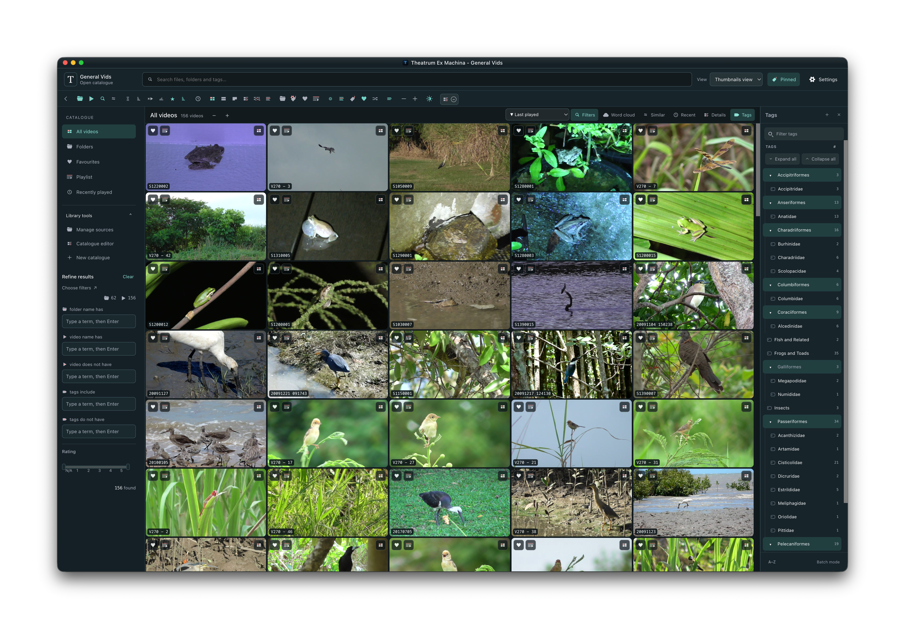

# Theatrum Ex Machina

**Theatrum Ex Machina** is a desktop video catalogue for browsing, searching, previewing, and organising your video collection. Browse thumbnails and filmstrips, organise videos with tags, ratings, and notes, and open videos in your preferred player. Your videos stay in their original folders; each hub stores its catalogue and generated previews separately.

[Download v2.0.0](https://github.com/sebiimaks/Theatrum-Ex-Machina/releases/tag/v2.0.0) · [Changelog](./CHANGELOG.md) · [Report an issue](https://github.com/sebiimaks/Theatrum-Ex-Machina/issues)

Theatrum Ex Machina is an independent personal fork of [Video Hub App](https://www.videohubapp.com/), developed with LLM assistance. It is not supported or endorsed by the original developer. Its name and logo are specific to this fork.

## Install

Version **2.0.0**, released **22 September 2026**, is available for **Apple Silicon Macs (ARM64)**.

1. Open the [2.0.0 release](https://github.com/sebiimaks/Theatrum-Ex-Machina/releases/tag/v2.0.0) and download `theatrum-ex-machina-v2.0.0-arm64.zip`.
2. Extract the ZIP and move **Theatrum Ex Machina.app** to your Applications folder or another location of your choice.
3. Open the app. This build is unsigned and unnotarized, so macOS may require approval before its first launch.

Updates are installed manually from the [releases page](https://github.com/sebiimaks/Theatrum-Ex-Machina/releases); the app does not check for updates automatically. Keep a backup of your catalogues before upgrading.

The release also provides a SHA-256 checksum manifest and the matching FFmpeg/x264 source archive. You only need the application ZIP to run the app. GitHub's **Source code** archives contain the project source, not an installable application.

Linux AMD64 Debian packages are available as expiring CI test artifacts, not as part of this public release. See [Building and test packages](./BUILDING.md) for details.

## Open or create a hub

A *hub* is a saved video catalogue. New catalogues use the `.scaena` extension.

- To open an existing hub, choose **Open catalogue** or select an entry under **Recent catalogues**. You can also drop a `.scaena` file onto the app.
- To create a hub, enter a catalogue name, select the folder containing your videos, and choose where to save the catalogue and previews. Adjust **Preview options** if needed, then select **Create catalogue**.
- To add or manage source folders later, open **Settings → Library & sources**. This is also where you can rescan folders and regenerate their previews.

Keep the catalogue and its generated previews together when moving or backing up a hub. Browsing saved previews does not require the original video drive to be connected; playback and file operations do.

## Browse and organise videos

Use the left sidebar to switch between **All videos**, **Folders**, **Favourites**, **Playlist**, and **Recently played**. Recently played contains only videos with playback history. Search from the top bar and use **Filters** to narrow the results.

Choose a gallery layout from **View** and change preview size with the **−** and **+** controls beside the video count. **Compact view** reduces spacing in thumbnail and clip layouts.

The gallery toolbar provides **Word cloud**, **Similar**, **Recent**, **Details**, and **Tags**. Similar, Recent, and Details open along the bottom of the gallery. Tags opens the right-side panel, where you can expand and collapse tag branches, filter videos, and organise tags into hierarchies.

Select a video to work with its tags, rating, and notes in **Details**. Enable **Auto-open Details** to open that panel whenever you select a video. In double-click mode, one click highlights a video, a later separate click deselects it, and a double-click opens it for playback. Deselecting also closes Details when Auto-open Details is enabled. These controls work in both regular and compact layouts.

Right-click a video for actions such as **Rename file**, **Open folder**, and **Regenerate thumbnails**. Actions that need the original video are unavailable while its source is disconnected or access has not been granted.

Open **Settings** to search preferences or browse categories for appearance, playback, previews, filters, tags, and keyboard shortcuts. Use the eye controls beside settings to choose which controls appear in the pinned toolbar. **Pinned** shows or hides that toolbar.

On macOS, application settings and the ordinary browser profile are stored in `~/Library/Application Support/Theatrum Ex Machina`. Settings are shared across hubs. If this folder has no `settings.json`, the app recovers the newest valid settings file from the known older Theatrum Ex Machina and Video Hub App support folders. Existing settings in the new folder take priority, and the older folders are left intact. Catalogue files and video previews stay in their existing locations.

During settings recovery, existing folder and player permissions from the previous `theatrum-ex-machina` support folder are preserved if no permission store exists in the new folder. Preferences from older Video Hub App versions do not grant file access; select your hub again if it does not reopen automatically. Windows portable builds continue to keep settings beside the portable app.

## Reconnect a video source

Connect the external drive or network folder containing your videos. The app checks for returning source folders while the hub remains open; restarting is not required.

If this catalogue has not been granted access to a returning folder, an **Allow Catalogue Folder Access?** dialog appears. Review the listed paths and choose **Allow These Folders** to enable playback, scanning, and file operations. Choose **Open Without These Folders** to keep browsing the saved catalogue without accessing them.

Previously approved folders reconnect automatically. **Hide offline** results refresh when a source connects or disconnects. Automatic folder watching has its own permission and is restored only when previously approved.

If a source still appears offline, check that it is mounted at the saved location and is readable by your account. The app's folder approval does not replace operating-system or network access permissions.

## Use Video Hub App catalogues

Open a legacy `.vha2` catalogue to choose between browsing it **read only** and creating an editable `.scaena` duplicate. The original catalogue remains unchanged.

You can also export an editable `.scaena` catalogue as a Video Hub App-compatible `.vha2` copy from the library settings. Review the conversion notice before exporting: fork-specific information such as Date Added, tag hierarchy, and alternate media locations is not retained in that format.

## What's new in 2.0.0

- A redesigned library with catalogue navigation, consistent gallery controls, searchable settings, and improved compact layouts.
- Collapsible tag hierarchies, a Recently played collection, and a gallery toolbar for Word cloud, Similar, Recent, Details, and Tags.
- Clear video selection, optional Auto-open Details, and editable notes in the bottom Details panel.
- Source-folder reconnection while a hub is open, including access prompts for newly available folders and automatic refresh of Hide offline results.

Read the [full changelog](./CHANGELOG.md) for release history and detailed changes.

## Help and source code

Report problems or request features in [this fork's issue tracker](https://github.com/sebiimaks/Theatrum-Ex-Machina/issues). Include your app version, operating system, and the steps needed to reproduce the problem.

For development and local packages, see [Building from source](./BUILDING.md). For the original supported Video Hub App, visit [videohubapp.com](https://www.videohubapp.com/) or [whyboris/Video-Hub-App](https://github.com/whyboris/Video-Hub-App).

## Licensing and attribution

Theatrum Ex Machina is based on Video Hub App, copyright © 2022 Boris Yakubchik. The application and fork modifications are distributed under the [MIT License](./LICENSE). Please support the original developer, [whyboris](https://github.com/whyboris).

Third-party software retains its own copyright and licence terms. Required notices are included in [Third-party notices](./legal/THIRD_PARTY_NOTICES.txt) and in each packaged application, alongside Electron's licence and Chromium's third-party credits.

Packaged `ffmpeg` and `ffprobe` executables include FFmpeg and x264 components under GPL-2.0-or-later. See the [FFmpeg and x264 notice](./legal/MEDIA-TOOLS.md) for licensing, corresponding-source, and redistribution information. Matching media source is supplied alongside each binary release.
